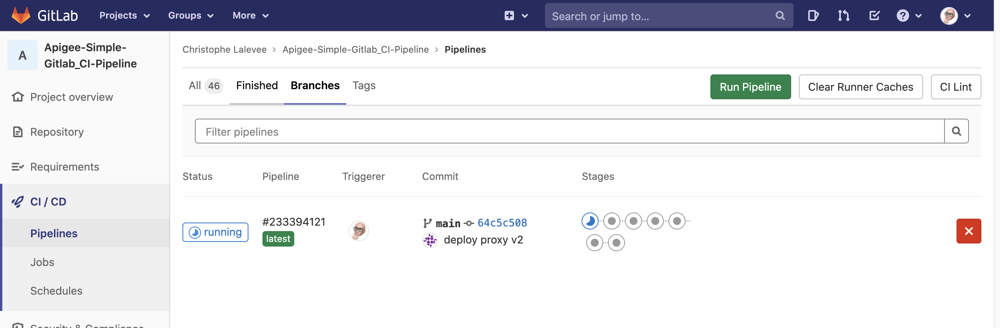

[](https://pypi.python.org/pypi/ansicolortags/) 

# Apigee CI/CD using GitHub, GitLab CI and Maven 

**This is not an official Google product.**<BR>This implementation is not an official Google product, nor is it part of an official Google product. Support is available on a best-effort basis via GitHub.

***

## Goal

Simple implementation for a CI/CD pipeline for Apigee using GitHub repository, 
[CI/CD with GitLab](https://docs.gitlab.com/ee/ci/introduction/) and the [Apigee Deploy Maven Plugin](https://github.com/apigee/apigee-deploy-maven-plugin).  

The CICD pipeline includes:

- Git branch dependent Apigee environment selection and proxy naming to allow
  deployment of feature branches as separate proxies in the same environment
- Static Apigee Proxy code analysis using [apigeelint](https://github.com/apigee/apigeelint)
- Static JS code analysis using [eslint](https://eslint.org/)
- Unit JS testing using [mocha](https://mochajs.org/)
- Integration testing of the deployed proxy using
  [apickli](https://github.com/apickli/apickli)
- Packaging and deployment of an Apigee configuration using
  [Apigee Config Maven Plugin](https://github.com/apigee/apigee-config-maven-plugin)
- Packaging and deployment of the API proxy bundle using
  [Apigee Deploy Maven Plugin](https://github.com/apigee/apigee-deploy-maven-plugin)

**This CICD pipeline allows deployment to both Apigee Edge and Apigee X/hybrid. A variable (API_VERSION) in gitlab-ci.yaml file defines the deployment target.**


### API Proxy and Apigee configuration

The folder [./apiproxy](./apiproxy) includes a simple API proxy bundle, a simple Apigee configuration file [./EdgeConfig/edge.json](./EdgeConfig/edge.json) as well as the following resources:

- [.gitlab-ci File](./.gitlab-ci.yml) to define a GitLab CI
  multi-branch pipeline.
- [test Folder](./test) to hold the unit and integration
  tests.


## Target Audience

- Operations
- API Engineers
- Security

## Limitations & Requirements

- The authentication to the Apigee Edge management API is done using OAuth2. If
  you require MFA, please see the [documentation](https://github.com/apigee/apigee-deploy-maven-plugin#oauth-and-two-factor-authentication)
  for the Maven deploy plugin for how to configure MFA.
- The authentication to the Apigee X / Apigee hybrid management API is done using a GCP Service Account. See [CI/CD Configuration Instructions](#CI/CD-Configuration-Instructions).

## Prerequisites

### GitLab

The setup described in this reference implementation is based on GitLab CI. So, you must have a GitLab account you will use to create a project mirrored with your GitHub repository or to clone this GitHub repository.

#### Option A: **Import** this GitHub repository into a GitLab project.

Using the GitLab importer, you can import your GitHub repositories to GitLab.com or to your self-managed GitLab instance. <BR>GitLab Guide: [Import your project from GitHub to GitLab](https://docs.gitlab.com/ee/user/project/import/github.html#import-your-github-repository-into-gitlab)


#### Option B: **Mirror** this GitHub repository to a GitLab project.

With GitLab CI/CD for GitHub, users can create a CI/CD project in GitLab connected to an external GitHub code repository. This will automatically configure several components:

- Pull mirroring of the repository.
- A push webhook to GitLab triggers CI/CD immediately once a code is committed.
- GitHub project service integration webhooks CI status back to GitHub.

To configure it, clone this Github repository and configure GitLab for GitHub.<BR> GitLab Guide:
[Using GitLab CI/CD with a GitHub repository](https://docs.gitlab.com/ee/ci/ci_cd_for_external_repos/github_integration.html).


## CI/CD Configuration Instructions

### Apigee hybrid / Apigee X only

Apigee hybrid / Apigee X deployement requires a GCP Service Account with the following roles (or a custom role with all required permissions):

- Apigee API Admin
- Apigee Environment Admin

To create it in your Apigee organization's GCP project, use following gcloud commands (or GCP Web UI):

```sh
SA_NAME=<your-new-service-account-name>

gcloud iam service-accounts create $SA_NAME --display-name="GitLab-ci Service Account"

PROJECT_ID=$(gcloud config get-value project)
GITLAB_SA=$SA_NAME@$PROJECT_ID.iam.gserviceaccount.com

gcloud projects add-iam-policy-binding "$PROJECT_ID" \
  --member="serviceAccount:$GITLAB_SA" \
  --role="roles/apigee.environmentAdmin"

gcloud projects add-iam-policy-binding "$PROJECT_ID" \
  --member="serviceAccount:$GITLAB_SA" \
  --role="roles/apigee.apiAdmin"

gcloud iam service-accounts keys create $SA_NAME-key.json --iam-account=$GITLAB_SA --key-file-type=json 

```

Copy `<your-new-service-account-name>-key.json` file content to clipboard. 

### Initialize a GitLab (option A) or GitHub (option B) Repository

1.  **Create a GitLab/GitHub repository to hold your API Proxy** <BR>

To use the `Apigee-Simple-Gitlab_CI-Pipeline`
in a **GitHub** repository `github.com/my-user/my-api-proxy-repo` follow these
steps:

```bash
git clone git@github.com:g-lalevee/Apigee-Simple-Gitlab_CI-Pipeline.git
cd Apigee-Simple-Gitlab_CI-Pipeline
git init
git remote add origin git@github.com:my-user/my-api-proxy.git
git checkout -b feature/cicd-pipeline
git add .
git commit -m "initial commit"
git push -u origin feature/cicd-pipeline
```

<BR>To use the `Apigee-Simple-Gitlab_CI-Pipeline`
in a **GitLab** repository `gitlab.com/my-user/my-api-proxy-repo` follow these
steps:

```bash
git clone git@github.com:g-lalevee/Apigee-Simple-Gitlab_CI-Pipeline.git
cd Apigee-Simple-Gitlab_CI-Pipeline
git init
git remote add origin git@gitlab.com:my-user/my-api-proxy.git
git checkout -b feature/cicd-pipeline
git add .
git commit -m "initial commit"
git push -u origin feature/cicd-pipeline
```

You can also use the GitLab UI and the Import Project wizard to create a Gitlab project from your GitHub repository: [Import Project wizard](https://gitlab.com/projects/new#import_project)
 

### GitLab Configuration 

1.  **(Option B only)** <BR>
Start or configure your GitLab project as described in [Using GitLab CI/CD with a GitHub repository](https://docs.gitlab.com/ee/ci/ci_cd_for_external_repos/github_integration.html).

> If the target is Apigee Edge...

2.  Add custom environment variables `APIGEE_CREDS_USR` and `APIGEE_CREDS_PSW`, to store your Apigee User ID and password:
- Go to your project’s Settings > CI/CD and expand the Variables section.
- Click the **Add Variable** button.<BR>In the Add variable modal, fill in the details:
  - Key: APIGEE_CREDS_USR
  - Value: your Apigee user ID 
  - Type: Variable
  - Environment scope: All
  - Protect variable (Optional): If selected, the variable is only available in pipelines that run on protected branches or tags.
  - Mask variable (Optional): If selected, the variable’s Value is masked in job logs. The variable fails to save if the value does not meet the masking requirements.
  - Click the **Add Variable** button
- Click again the **Add Variable** button.<BR>In the Add variable modal, fill in the details:
  - Key: APIGEE_CREDS_PSW
  - Value: your Apigee user ID password
  - Type: Variable
  - Environment scope: All
  - Protect variable (Optional): If selected, the variable is only available in pipelines that run on protected branches or tags.
  - Mask variable (Optional): If selected, the variable’s Value is masked in job logs. The variable fails to save if the value does not meet the masking requirements.
  - Click the **Add Variable** button

> If the target is Apigee X / Apigee hybrid

2.  Add custom environment variable `GCP_SERVICE_ACCCOUNT`, to store your GCP Service Account json key:
- Go to your project’s Settings > CI/CD and expand the Variables section.
- Click the **Add Variable** button.<BR>In the Add variable modal, fill in the details:
  - Key: GCP_SERVICE_ACCCOUNT
  - Value: paste clipboard
  - Type: File
  - Environment scope: All
  - Protect variable (Optional): If selected, the variable is only available in pipelines that run on protected branches or tags.
  - Mask variable (Optional): If selected, the variable’s Value is masked in job logs. The variable fails to save if the value does not meet the masking requirements.
  - Click the **Add Variable** button

## Run the pipeline

Using your favorite IDE...
1.  Update the **.gitlab-ci.yml** file<BR>
In global **Variables** section, change **DEFAULT_APIGEE_ORG**, **DEFAULT_APIGEE_ENV**, **TEST_HOST** values by your target Apigee organization and environment.<BR>
Update **API_VERSION** variable to define Apigee target: `googleapi` = Apigee X / Apigee hybrid, `apigeeapi` = Apigee Edge
2.  Read carefully the **before_script** section to check if the multibranch rules match your Git and Apigee environment naming and configuration.
3. Save
4. Commit, Push.. et voila!


Use the GitLab UI to monitor your pipeline execution:

- Go to your GitLab project > CI/CD > Pipeline.



- You can see all stages and jobs running.


- And the end of test stages you can download artifacts.


- For example, the results of integration tests with Apickli (download a zip file, open html content with your browser)


